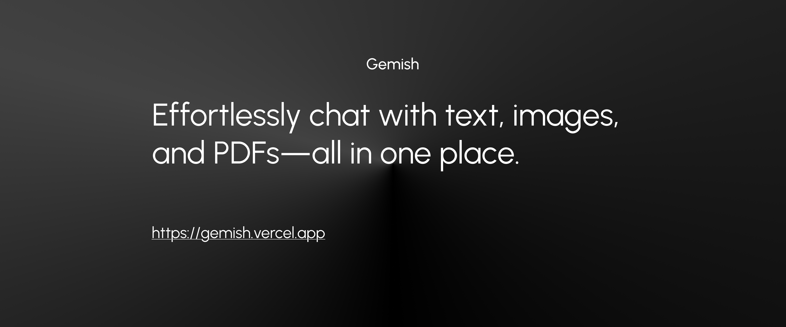

# Gemish

Gemish is a user-friendly chat application that allows you to communicate seamlessly with text, images, and PDFs. Designed for both personal and professional use, Gemish enables real-time conversations, supports image and PDF uploads for interactive chats, and ensures secure user authentication. Whether you're collaborating with friends, sharing documents, or discussing visuals, Gemish makes chatting smarter and more versatile.

## Status
🚧 **Work in Progress:** Gemish is actively under development! Some features like text chat and user authentication are working, while others (e.g., image and PDF chat) are still being built. Contributions and feedback are welcome as we shape the future of Gemish! 🚧

## Tech Stack
- **Frontend:** Nextjs, Tailwind CSS with Shadcn UI, Motion
- **AI:** Vercel AI SDK, Google AI Gemini model
- **Analytics:** PostHog for user behavior tracking and analytics
- **State Management:** Nuqs for URL search params management
- **Data Fetching:** SWR for efficient client-side data fetching
- **Backend:** Nextjs API route handlers
- **Database:** Neon Postgres with Drizzle ORM
- **Caching:** Upstash Redis for fast data caching
- **Deployment:** Vercel for hosting and easy deployment.

## License

Licensed under the [MIT license](https://github.com/GemishAI/gemish/blob/main/LICENSE.md).
